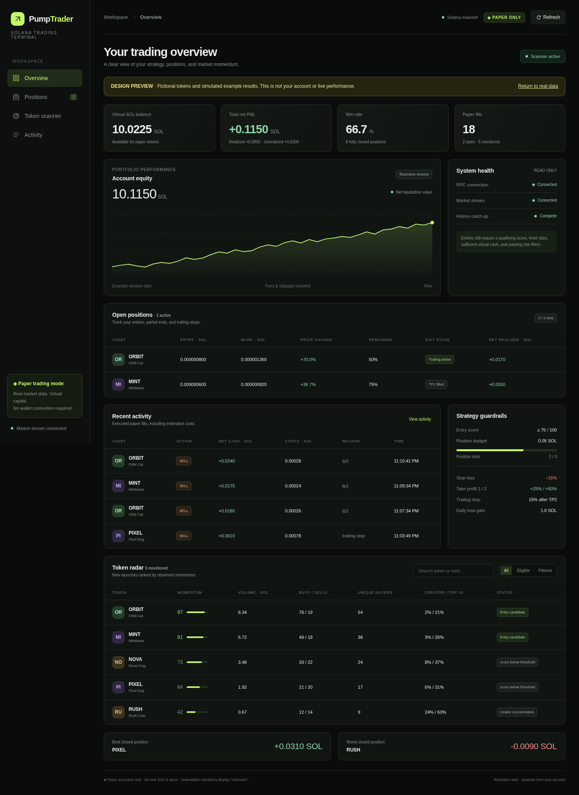

# PumpTrader

Read-only Solana mainnet scanner and automated **paper-trading** application for newly created Pump.fun tokens. Starting balance: **10 SOL**, position budget including entry costs: **0.05 SOL**, entry score: **75**, maximum positions: **3**, daily loss gate: **1 SOL**.

**V1 never signs or submits blockchain transactions. No wallet, seed phrase or private key is requested, generated or stored.** This is a simulation, not evidence of attainable live returns.

## Run locally on macOS

1. Install Node.js **24 LTS** (24.5 or newer) from https://nodejs.org (or `brew install node@24`, following Homebrew's PATH instructions). Verify `node --version` starts with `v24` or newer.
2. Clone this repository and enter it:

   ```bash
   git clone https://github.com/houstonluxecleaners/meme-bot.git
   cd meme-bot
   npm ci
   cp .env.example .env
   ```

3. Edit `.env` with your **Solana mainnet** HTTP and WebSocket RPC endpoints. The included public endpoints can be used for an initial connection check, but a dedicated provider is recommended. Required provider features: `logsSubscribe` with mentions filters, `getGenesisHash`, parsed `getAccountInfo`, `getProgramAccounts` filtered by mint for SPL Token and Token-2022, `getSignaturesForAddress`, and `getTransaction` history. Providers often restrict full holder scans on free plans. Use matching HTTPS/WSS endpoints; never add wallet credentials. Endpoint API credentials remain local in the ignored `.env`; do not commit them.
4. Start:

   ```bash
   npm run dev
   ```

5. Open **http://localhost:3000** on your Mac. Keep the terminal running. Stop with **Control+C**.

For a compiled run:

```bash
npm run build
npm start
```

The dashboard binds only to loopback. `DASHBOARD_PORT` changes the port; `DATABASE_PATH` changes the SQLite file. Missing RPC access does not prevent opening the dashboard: it displays disconnected status and blocks entries. Do not expect any simulated trade until token activity, holder information, observation history and a score of at least 75 all meet the configured rules.

## Architecture

- `src/blockchain`: read-only `@solana/kit` RPC/PDA helpers, strict official-IDL decoding, program-owner checks, SOL pricing, dynamic fee tiers, complete wallet-aggregated holder snapshots, and WebSocket reconnection.
- `src/scanner`: authenticated program-context event extraction, creation discovery, trade activity, signature deduplication and bounded transaction-history catch-up.
- `src/strategy`: filters, normalized momentum and exit decisions. All weights, thresholds and observation windows live in **`src/config.ts`**.
- `src/execution`: `ExecutionAdapter` separates asynchronous execution from pure position valuation. V1 implements **only** `PaperExecutor`. Strategy never constructs Solana transactions. A future live adapter must handle signing, transaction lifecycle, reconciliation and idempotency separately; V1 provides no live switch.
- `src/portfolio`: balance/risk limits, pending entry reservations, delayed execution and partial exits.
- `src/database`: SQLite WAL, schema initialization, ledger transactions and persistent exit state.
- `src/dashboard`: local HTTP server and dependency-free web dashboard.

## Strategy and risk

Tracked data: mint, name, ticker, on-chain creation time, creator, curve address/state, initial SOL market cap where calculable, observed SOL volume, buy/sell counts, unique buyers, creator holdings and top-ten wallet concentration. Activity totals begin when a token is discovered; this is not a complete historical indexer. Curve and pool vault holdings are excluded from top-holder concentration, but creator holdings are always measured against total supply.

A token needs at least 60 seconds of observation, 10 trades, 5 unique buyers and 0.5 SOL observed volume in the last two 30-second windows. Defaults reject creator concentration above 15% and top-ten concentration above 50%. Missing, stale or inconsistent required data blocks entry. Wallet concentration cannot identify related wallets or coordinated ownership.

The 0–100 score combines transaction velocity, new buyer growth, buy share, volume acceleration, positive price momentum, holder growth and inverse creator/top-holder concentrations. Components are clamped to 0–1, weighted and divided by total weight. Absence of a previous volume window gives zero acceleration, not an infinite score. See `normalization` and `weights` in `src/config.ts`.

The daily gate uses UTC calendar days: today's net realized losses plus current open position losses must remain below 1 SOL. Positive open P&L cannot offset losses. Unvalued open positions also block entries. Exits continue during the entry gate. Execution delay and failed fills can cause realized losses to exceed the limit; it is an entry circuit breaker, not a guaranteed maximum loss. Open positions and pending entries reserve the three available slots. Cash is checked again when recording fills. SQLite enforces at most one open position per mint.

- Stop loss: price down **15%** from simulated entry fill price; sell all remaining.
- TP1: price up **25%**; sell **25% of original tokens**.
- TP2: price up **50%**; sell another **25% of original tokens**.
- After TP2: track a high-water price and exit remaining tokens after a **15%** drawdown.

If price jumps over both targets, TP1 and TP2 execute sequentially with their own delays. Stop loss takes precedence. A triggered exit is queued for execution; the eventual fill can differ from its trigger. There is no fabricated exit during an RPC outage.

## Simulation and accounting

Each simulated order fetches a new quote **after** the configured 1.5-second delay. Constant-product reserve math uses integer raw token units and lamports, accounts for order price impact, checks real available reserves, and applies another 100 bps of adverse slippage. Dynamic Pump/PumpSwap protocol, creator and applicable LP fees are read from the on-chain fee config. Fees are rounded conservatively. Default network costs are 5,000 base + 10,000 priority lamports per fill; initial ATA rent estimate is 2,039,280 lamports per entry and is conservatively expensed rather than recovered. These are configurable estimates, not a measured live fee quote.

The 0.05 SOL entry budget includes entry fees and rent. Sell proceeds are net of fees. Cost basis includes all entry costs, is allocated over partial exits, and reconciles exactly to the remaining lamport balance. Unrealized P&L estimates a net liquidation using current reserves/costs; stale or unsellable positions display **Unknown**, not zero. Win rate and best/worst results use fully closed positions. “Trades” counts individual fills; partial exits count separately.

PumpSwap quotes use **raw quote vault balance + signed `virtual_quote_reserves`**. Canonical migrated SOL pools are derived from the documented PDA seeds. V1 rejects non-SOL quote assets, mayhem coins and known transfer-fee/hook/confidential/interest-bearing/scaled-UI/nontransferable mint extensions rather than pretending to price them. Pump.fun transfer behavior, MEV, exact instruction rounding, inclusion probability and market reaction to a hypothetical paper order are not fully modeled. A paper fill never changes the real reserves.

## Persistence, connection recovery and limits

SQLite creates the requested `tokens`, `signals`, `paper_trades`, `positions`, `price_snapshots` tables plus internal `state`. Signals record rejected/scheduled/failed/filled decisions; paper fills record entry/exit reasons, quantities, fees, cash flows, net realized P&L and source quotes. Balances, positions, take-profit flags and trailing highs survive restart. Pending orders are intentionally canceled by a restart and reevaluated against fresh data.

WebSockets use acknowledgement checks, ping/pong and exponential reconnect backoff. Reconnect catch-up replays confirmed transactions in chronological order and deduplicates signatures. Catch-up is bounded by `maxCatchupPages`; exceeding it, a malformed event or queue overflow disables entries. If an outage exceeds provider history or configured limits, investigate before increasing limits or starting a new observation session with a separate database. Existing positions must not be discarded to hide losses.

On first start, discovery begins with the current stream, not all historical launches. At most 100 tokens are monitored, expiring after 30 minutes unless a position is open. HTTP uses Node’s environment proxy support; WebSockets use the configured HTTPS proxy when present. TLS verification remains enabled. RPC requests are serialized with timeouts, spacing and bounded retries. Refresh batches prioritize open positions. Refresh and holder scans can add latency beyond the minimum execution delay; delayed orders use the eventual refreshed quote. Full holder scans are expensive and may be unavailable on public RPC. Tokens with incomplete supply accounting are rejected (including withheld token balances). HTTP reads at confirmed commitment are slot-checked where practical, but are not an atomic multi-account snapshot. Confirmed data can still be rolled back; this V1 does not reconstruct portfolio history after chain reorganizations.

No real mainnet booking, transfer, swap or payment is performed by tests. Offline fixtures do not prove live provider compatibility. The dashboard exposes connection status and entries stay blocked while mainnet validation or stream catch-up fails.

## Official upstream sources

Vendored documentation and IDLs are from https://github.com/pump-fun/pump-public-docs, pinned at the exact commit in `vendor/pump-public-docs/REVISION`. Relevant sources include `PUMP_PROGRAM_README.md`, `PUMP_SWAP_README.md`, `FEE_PROGRAM_README.md`, and `NEGATIVE_VIRTUAL_QUOTE_RESERVES.md`. Verify updated official IDLs and add decoder fixtures before replacing them; unknown layouts must fail closed. The vendored documentation describes live transaction instructions for reference; PumpTrader does not implement them.

## Quality checks

```bash
npm run lint
npm run typecheck
npm test
npm run build
```

Tests cover creation decoding, program provenance, signed reserves, fee tiers, holder aggregation, missing/stale data, momentum, stop/partial/trailing exits, delayed fresh fills, simulated costs, duplicate positions, slot reservations, daily loss gates, SQLite restart and WebSocket reconnect. Public RPC connectivity is an independent runtime check.

Database files are ignored by Git. To preserve your paper history, back up the SQLite database together with its WAL state after stopping the bot. Use a separate `DATABASE_PATH` for a fresh simulation.

## Using a downloaded source archive

If the implementation has not been uploaded to GitHub yet, extract `PumpTrader.zip`, open Terminal in its `PumpTrader` folder, then run `npm ci`, `cp .env.example .env`, and `npm run dev` as above. The ZIP includes source and the lockfile, but no private settings, database or installed packages.

`PumpTrader.bundle` also preserves the Git commit and complete history. To upload it using your own existing GitHub authentication:

```bash
git clone /path/to/PumpTrader.bundle meme-bot
cd meme-bot
git remote set-url origin https://github.com/houstonluxecleaners/meme-bot.git
git push -u origin main
```

If Git needs authentication, connect your GitHub account locally using GitHub Desktop or the GitHub CLI browser login. Never send account credentials in chat.

## Dashboard design preview

The redesigned terminal includes portfolio cards, a session equity chart, position exit stages, searchable momentum rankings, system health, strategy limits and activity views. The live chart collects actual net liquidation observations while that browser tab is open; it is not a historical backtest.

After starting the bot, open `http://localhost:3000/?demo=1` to see the interface populated with **clearly labeled fictional example data**. The preview does not fetch your account data or submit orders. Opening it does not pause the background paper-trading engine. Return to `/` to see your actual account and connection status.


